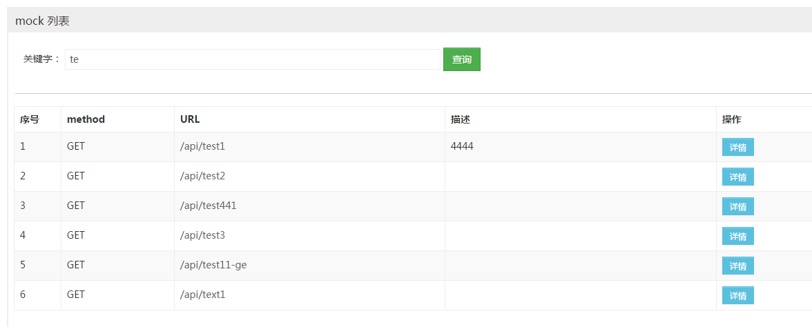
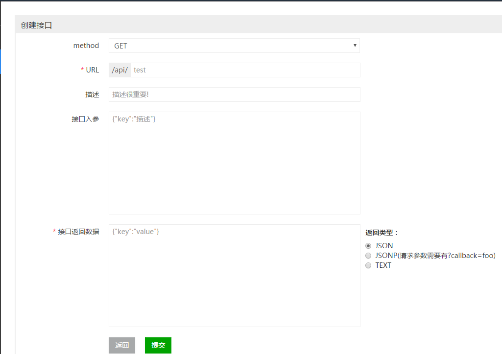
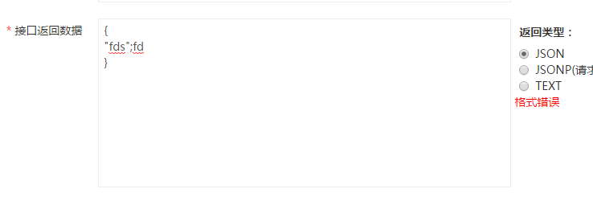
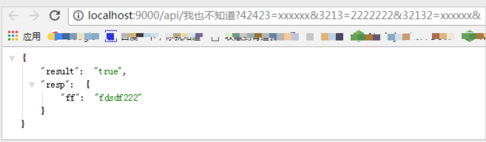
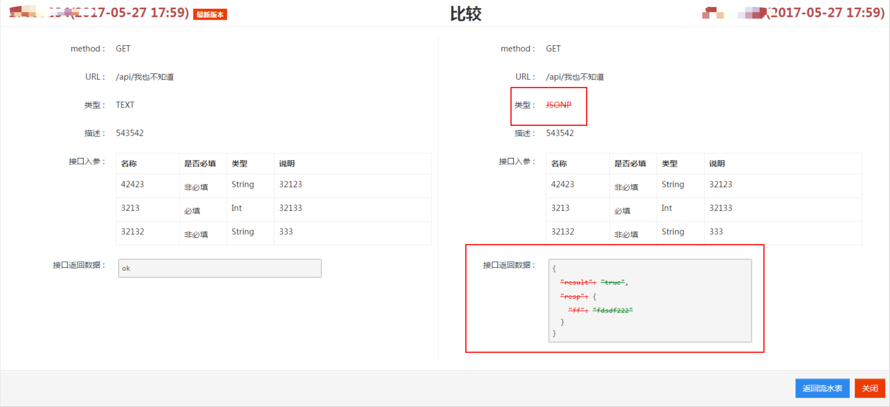
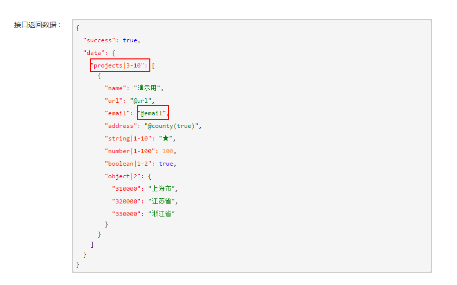
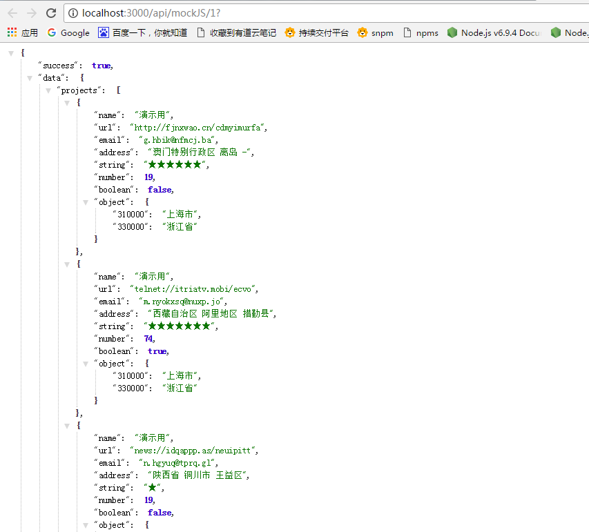

# iMock
 a node easy mock by express

# 背景
以前撸的一个简陋版本的 mock 平台，基于 express的，用mongoDB 存储数据，支持mockjs语法。

# 数据库
MongoDB

## 安装

### MAC OS系统
安装
```$xslt
brew install mongodb
```
启动
```$xslt 
mongod --config /usr/local/etc/mongod.conf --fork
```

对于文件 /usr/local/etc/mongod.conf 配置信息

```$xslt
# 日志
systemLog:
# 日志为文件
  destination: file
# 文件位置
  path: /usr/local/var/log/mongodb/mongo.log
# 是否追加
  logAppend: true
#进程
processManagement:
# 守护进程方式
  fork: true
storage:
  dbPath: /usr/local/var/mongodb
net:
# 绑定IP，默认127.0.0.1，只能本机访问
  bindIp: 127.0.0.1
# 端口
  port: 27017
```

主要使用 `mongoose` 进行数据库的 CRUD 操作的


# 具体功能

- mock数据CRUD
- mock数据分类
- mock数据编辑的历史版本对比
- mock数据的预览访问。

# 项目截图

</img>
</img>
</img>
</img>
</img>
</img>
</img>
</img>
</img>


